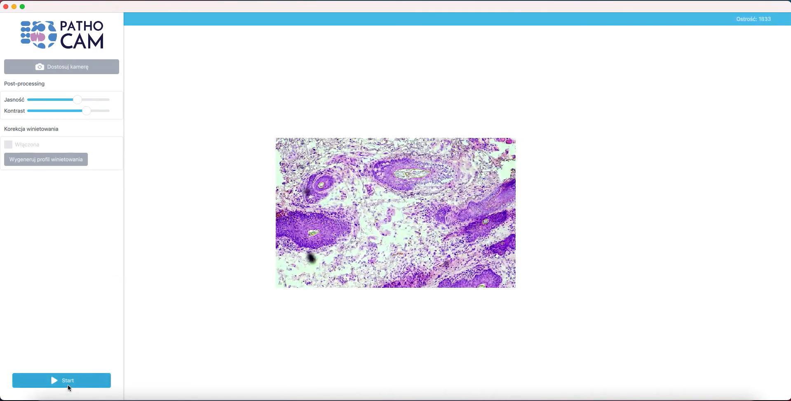

# PathoCam Clone - Hệ thống Whole Slide Imaging (WSI)

## 📋 Giới thiệu

PathoCam Clone là một hệ thống phần mềm quét slide kính hiển vi thủ công (Manual Whole Slide Imaging) được phát triển để số hóa các mẫu mô bệnh học. Dự án này sử dụng công nghệ Image Registration tiên tiến để tự động ghép các ảnh tile thành một bức ảnh toàn cảnh chất lượng cao.

**Phiên bản:** 7.0 - Image Registration
**Ngôn ngữ:** Python 3
**Framework:** PyQt5, OpenCV

## ✨ Tính năng chính

- **🎥 Live View Camera**: Xem trực tiếp từ camera với độ phân giải cao (1280x720)
- **🔄 Image Registration**: Tự động ghép ảnh chính xác bằng thuật toán template matching
- **📍 Position Tracking**: Theo dõi vị trí di chuyển của bàn kính bằng phase correlation
- **🖼️ Real-time Stitching**: Ghép ảnh theo thời gian thực khi quét
- **⚙️ Cài đặt linh hoạt**: Điều chỉnh tần suất capture (5-60 frames)
- **💾 Lưu kết quả**: Xuất ảnh cuối cùng dưới dạng PNG chất lượng cao
- **📊 Thống kê**: Hiển thị số lượng tiles, vị trí hiện tại, và FPS

## 🛠️ Công nghệ sử dụng

### Thuật toán

1. **Position Tracking (Rough)**:

   - Sử dụng Phase Correlation để ước lượng vị trí di chuyển giữa các frame
   - Downscale ảnh để tăng tốc xử lý
   - Lọc nhiễu với ngưỡng 5 pixels
2. **Image Registration (Precise)**:

   - Template Matching với canvas hiện tại để tìm vị trí chính xác
   - Tìm kiếm trong vùng ±150 pixels từ vị trí ước lượng
   - Sử dụng template từ trung tâm tile để tăng tốc
   - Ngưỡng confidence > 0.3 để đảm bảo độ chính xác

### Thư viện chính

- **OpenCV 4.5+**: Xử lý ảnh, template matching, phase correlation
- **NumPy 1.19+**: Tính toán ma trận và xử lý dữ liệu
- **PyQt5 5.15+**: Giao diện người dùng đồ họa

## 📦 Yêu cầu hệ thống

- Python 3.7 trở lên
- Camera USB (khuyến nghị độ phân giải 1280x720 trở lên)
- Windows 10/11 (đã test trên Windows 10)
- RAM: Tối thiểu 4GB (khuyến nghị 8GB)
- Ổ cứng: Dung lượng trống tùy theo kích thước ảnh quét

## 🚀 Cài đặt

### 1. Clone repository

```bash
git clone <repository-url>
cd WSI
```

### 2. Cài đặt dependencies

```bash
pip install -r requirements.txt
```

Hoặc cài đặt thủ công:

```bash
pip install opencv-python>=4.5.0
pip install numpy>=1.19.0
pip install PyQt5>=5.15.0
```

### 3. Chạy chương trình

```bash
python pathocam_scanner.py
```

## 📖 Hướng dẫn sử dụng

### Bước 1: Kết nối Camera

1. Kết nối camera USB vào máy tính
2. Mở chương trình PathoCam Clone
3. Chọn camera từ dropdown (Camera 0, 1, 2...)
4. Nhấn nút **"🔌 Kết nối Camera"**
5. Kiểm tra Live View để đảm bảo camera hoạt động

### Bước 2: Chuẩn bị quét

1. Đặt slide kính hiển vi lên bàn kính
2. Điều chỉnh camera để có góc nhìn tốt nhất
3. Cài đặt **Capture interval** (mặc định: 15 frames)
   - Giá trị nhỏ hơn = nhiều tiles hơn = độ phân giải cao hơn
   - Giá trị lớn hơn = ít tiles hơn = quét nhanh hơn

### Bước 3: Bắt đầu quét

1. Nhấn nút **"▶ Bắt đầu quét"**
2. **Di chuyển CHẬM và ĐỀU** bàn kính theo hướng bạn muốn quét
3. Đảm bảo mỗi tile **overlap khoảng 50%** với tile trước
4. Quan sát Canvas bên phải để theo dõi tiến trình ghép ảnh
5. Theo dõi thống kê (số tiles, vị trí, FPS) ở panel bên trái

### Bước 4: Dừng và lưu kết quả

1. Nhấn nút **"⏹ Dừng"** khi hoàn thành quét
2. Nhấn nút **"💾 Lưu ảnh"** để xuất kết quả
3. Chọn vị trí lưu và tên file (mặc định: `scan_HHMMSS.png`)

### Lưu ý quan trọng

- ⚠️ **Di chuyển chậm và đều**: Di chuyển quá nhanh sẽ làm mất độ chính xác
- ⚠️ **Overlap 50%**: Mỗi tile phải overlap với tile trước để thuật toán hoạt động tốt
- ⚠️ **Ánh sáng ổn định**: Đảm bảo ánh sáng không thay đổi trong quá trình quét
- ⚠️ **Focus cố định**: Không thay đổi focus của kính hiển vi khi quét

## 🎯 Kết quả

### Hình ảnh kết quả

<!-- 
Phần này để người dùng tự thêm hình ảnh kết quả sau khi quét.
Có thể thêm các hình ảnh như:
- Screenshot giao diện chương trình
- Ảnh quét được (scan.png)
- So sánh trước/sau
- Video demo (nếu có)
-->

**Ví dụ cấu trúc thêm hình ảnh:**

### Ảnh quét mẫu mô bệnh học


### Giao diện chương trình


### Video demo

Xem video demo tại: [](./video/wsi-demo.mp4)

## 📊 Thống kê kỹ thuật

- **Độ phân giải camera**: 1280x720 pixels
- **FPS**: ~30 FPS
- **Kích thước canvas tối đa**: Tự động mở rộng (bắt đầu từ 3000x3000)
- **Độ chính xác registration**: ±1 pixel (với overlap tốt)
- **Tốc độ xử lý**: Real-time (không lag khi quét)

## 🔧 Xử lý lỗi

### Camera không kết nối được

- Kiểm tra camera đã được kết nối đúng chưa
- Thử chọn camera khác từ dropdown
- Đảm bảo không có chương trình khác đang sử dụng camera

### Ảnh ghép không chính xác

- Di chuyển chậm hơn
- Tăng overlap giữa các tiles (di chuyển ít hơn giữa các lần capture)
- Giảm Capture interval để có nhiều tiles hơn

### Chương trình chạy chậm

- Giảm Capture interval
- Đóng các ứng dụng khác để giải phóng RAM
- Kiểm tra CPU usage

## 📝 Cấu trúc dự án

```
WSI/
├── pathocam_scanner.py      # File chính chứa toàn bộ code
├── requirements.txt          # Danh sách dependencies
├── README.md                 # File này
├── .gitignore               # Git ignore rules
├── scan.png                 # Ảnh kết quả quét (ví dụ)
└── PathoCam - Manual Whole Slide Imaging Software, Digital slides.mp4  # Video demo
```

## 👨‍💻 Tác giả

**AI Assistant**

Dự án được phát triển như một giải pháp thay thế cho hệ thống PathoCam thương mại, sử dụng các kỹ thuật xử lý ảnh tiên tiến để đạt được độ chính xác cao trong việc ghép ảnh.

## 📄 License

Dự án này được phát triển cho mục đích giáo dục và nghiên cứu.

## 🙏 Lời cảm ơn

Cảm ơn các thư viện mã nguồn mở:

- OpenCV team
- NumPy team
- PyQt5 team

---

**Lưu ý**: Đây là phiên bản 7.0 với cải tiến Image Registration. Để có kết quả tốt nhất, vui lòng tuân thủ các hướng dẫn sử dụng ở trên.
